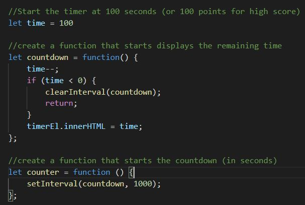
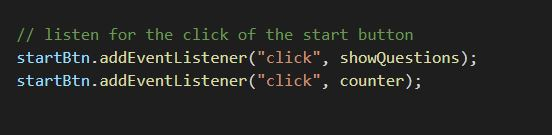
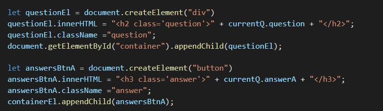
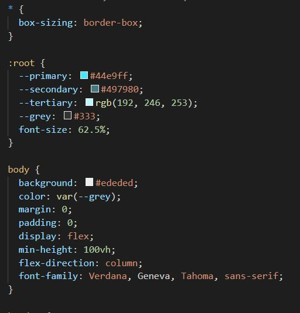

# JavaScript Quiz!

 ## Description:
**This is a README fort the creation of a JavaScript quiz, developed using my newly acquired skills in the use of Web API's, JavaScript, CSS and HTML.  Some of the methods and skills I used are noted below:**

* Comments were added to the script.js file as pseudocode and organization purposes:

* The questions were defined on a global scope for reference and use throughout by various functions:
* An eventListener was utilized to initiate the the quiz, timer and also to listen for answers and for the user to submit a highscore:

* Elements such as a div container and buttons were created dynamically:

* A style sheet and basic CSS was added to the quiz:

## Deployed Application

* [JavaScript Quiz](https://erin-michon.github.io/code-quiz/)

