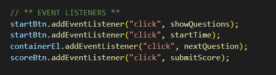

# JavaScript Quiz!

**This is a README fort the creation of a JavaScript quiz, developed using my newly acquired skills in the use of Web API's, JavaScript, CSS and HTML.  Some of the methods and skills I used are noted below:**

* Comments were added to the script.js file as pseudocode and organization purposes:

* The questions were defined on a global scope for reference and use throughout by various functions:
* An eventListener was utilized to initiate the the quiz and the timer:

* Elements such as a div container and buttons were created dynamically:

* A style sheet and basic CSS was added to the quiz:

## Deployed Application

* [JavaScript Quiz](https://erin-michon.github.io/code-quiz/)

## Future Goals
* Obtain support and work to complete the full acceptance criteria shown below:

    * GIVEN I am taking a code quiz
    * WHEN I click the start button
    * THEN a timer starts and I am presented with a question
    * WHEN I answer a question
    * THEN I am presented with another question
    * WHEN I answer a question incorrectly
    * THEN time is subtracted from the clock
    * WHEN all questions are answered or the timer reaches 0
    * THEN the game is over
    * WHEN the game is over
    * THEN I can save my initials and score